# Supported diagram types

Every diagram type `scripts/convert.py` can emit, with the mermaid source on
the left and the rendered Excalidraw output on the right.

The type is chosen from the **first directive line** of the input, so no flag
is needed:

```bash
python3 scripts/convert.py input.mmd output.excalidraw [--sloppiness 1|2|3] [--corners sharp|round] [--scale N]
```

| Directive | Emitter | Example |
|---|---|---|
| `flowchart` / `graph` | `flowchart.py` | [flowchart](#flowchart--graph) |
| `erDiagram` | `convert.py` (built in) | [ER diagram](#erdiagram) |
| `classDiagram` | `convert.py` (built in) | [class diagram](#classdiagram) |
| `sequenceDiagram` | `sequence.py` | [sequence diagram](#sequencediagram) |
| `gantt` | `gantt.py` | [gantt](#gantt) |
| `pie` | `pie.py` | [pie chart](#pie) |
| `quadrantChart` | `quadrant.py` | [quadrant chart](#quadrantchart) |
| `xychart-beta` | `bar.py` | [bar / line chart](#xychart-beta) |

Anything else falls through to the `classDiagram` parser.

---

## `flowchart` / `graph`

Nodes, `subgraph` groupings, edge labels, `classDef`/`class` fills and
`linkStyle` edge colours. Rendered as frame-less coloured boxes with bound
arrows.

<table>
<tr><td width="45%" valign="top">

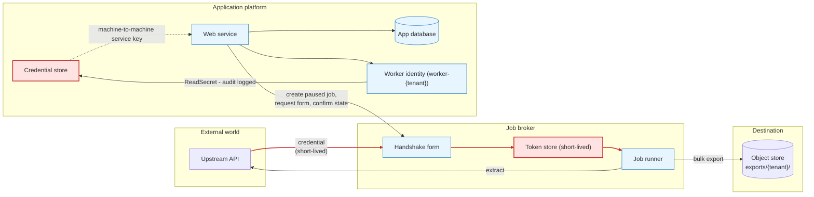

</td><td width="55%" valign="top">

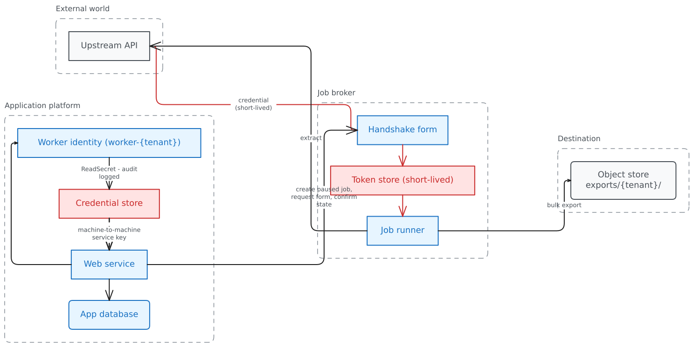

</td></tr>
</table>

Source: [`example-flowchart.mmd`](example-flowchart.mmd) &rarr;
[`example-flowchart.excalidraw`](example-flowchart.excalidraw)

---

## `erDiagram`

Entity attribute blocks with types, `PK`/`FK`/`UK` markers and per-column
comments, joined by crowfoot relationships.

<table>
<tr><td width="45%" valign="top">

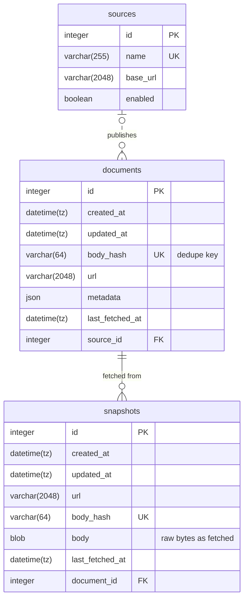

</td><td width="55%" valign="top">

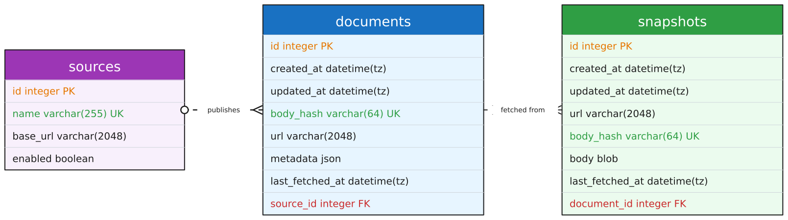

</td></tr>
</table>

Source: [`example-erd.mmd`](example-erd.mmd) &rarr;
[`example-erd.excalidraw`](example-erd.excalidraw)

---

## `classDiagram`

`direction LR`, class bodies of `+member` lines, and composition edges
(`*--` / `--*`). Good for file trees and containment hierarchies, not just
classes.

<table>
<tr><td width="45%" valign="top">

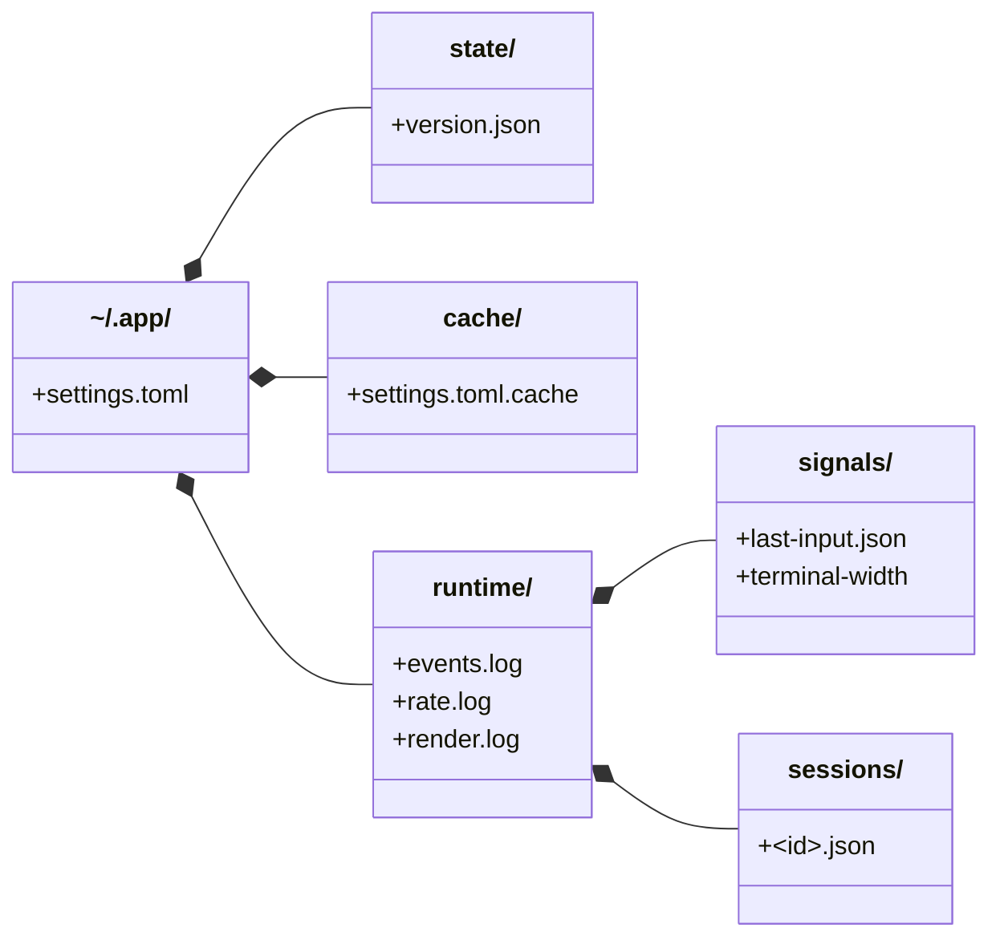

</td><td width="55%" valign="top">

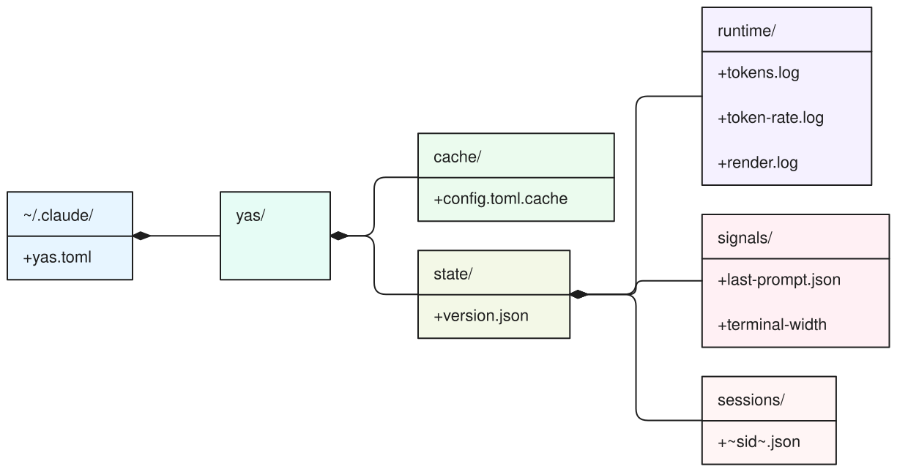

</td></tr>
</table>

Source: [`example-output.mmd`](example-output.mmd) &rarr;
[`example-output.excalidraw`](example-output.excalidraw)

---

## `sequenceDiagram`

`participant`/`actor` declarations, `autonumber`, solid/dashed and `x`-headed
messages, `note over`, and `par` / `loop` / `alt` / `opt` / `rect` blocks.
Rendered as participant headers over grey lifelines with bound message
labels.

<table>
<tr><td width="45%" valign="top">

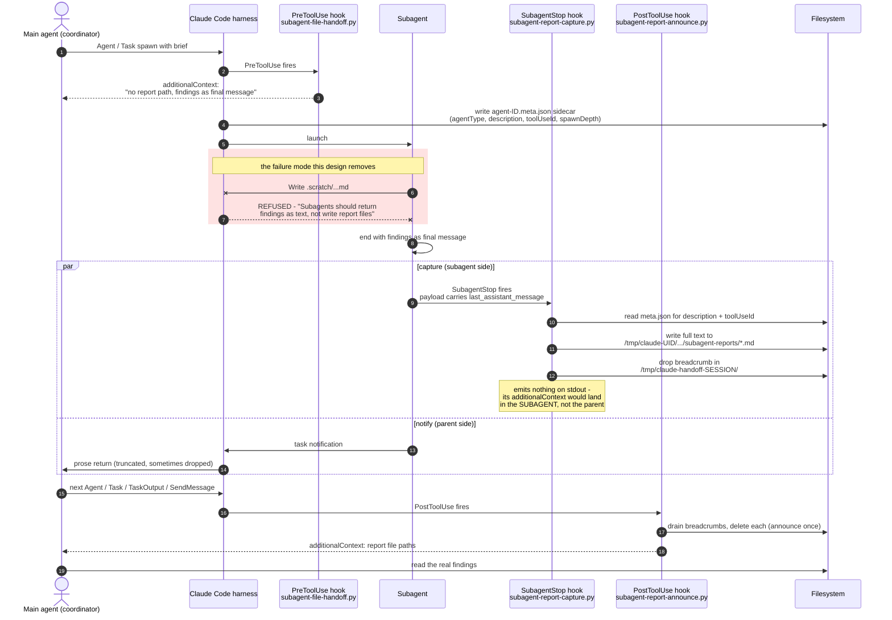

</td><td width="55%" valign="top">

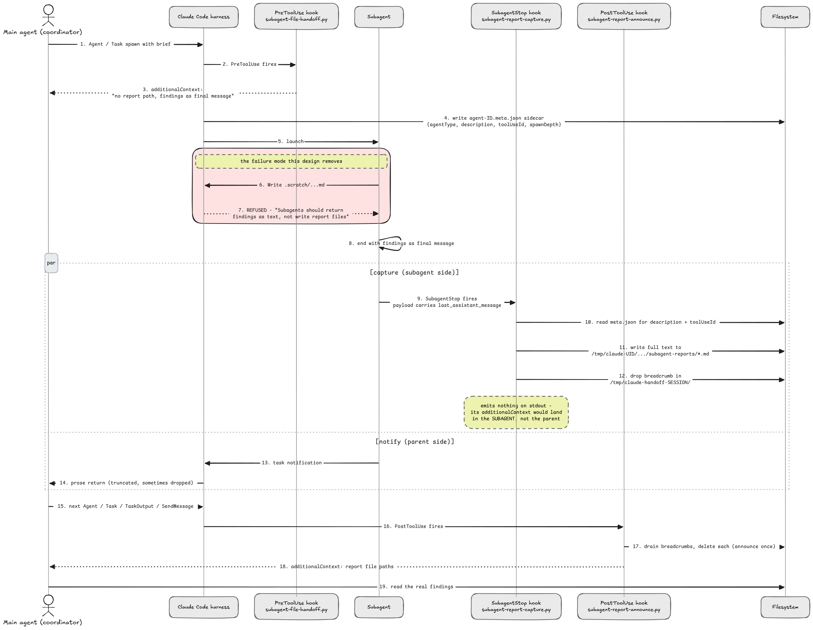

</td></tr>
</table>

Source: [`example-sequence.mmd`](example-sequence.mmd) &rarr;
[`example-sequence.excalidraw`](example-sequence.excalidraw)

---

## `gantt`

`title`, `dateFormat` / `axisFormat`, `section` groupings, task bars and
`milestone` diamonds.

<table>
<tr><td width="45%" valign="top">

```mermaid
gantt
    title Before — track1, warm (15.8s)
    dateFormat s
    axisFormat %S
    section main thread
    decode            :0, 1
    beats (madmom)    :1, 10
    snare/grid/struct :10, 11
    notation (pyin)   :11, 16
    section background
    waveform/spectrum/fingerprint/stereo :10, 11
    synth HPSS (serial, 22 core-s) :11, 16
```

</td><td width="55%" valign="top">

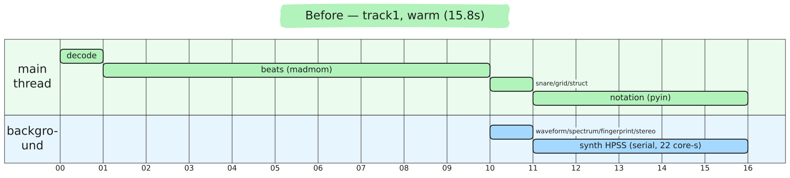

</td></tr>
</table>

Source: [`example-gantt.mmd`](example-gantt.mmd) &rarr;
[`example-gantt.excalidraw`](example-gantt.excalidraw)

---

## `pie`

`pie` (optionally `showData`) plus `"label" : value` slices. Rendered as
solid-filled wedges with percentage labels and a swatch legend.

<table>
<tr><td width="45%" valign="top">

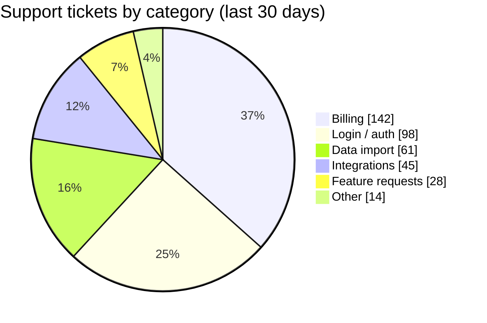

</td><td width="55%" valign="top">

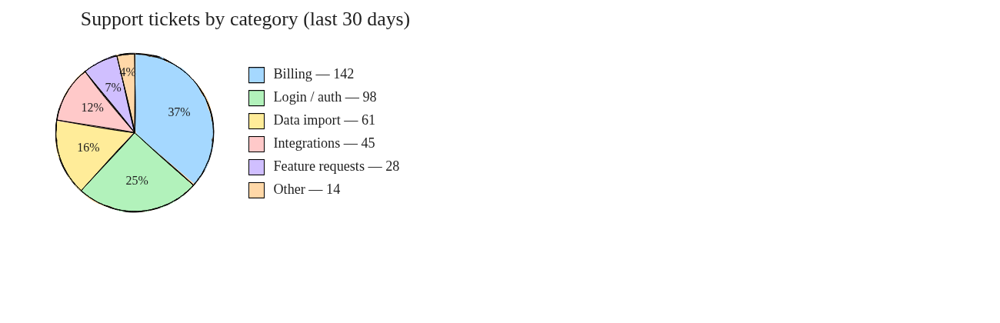

</td></tr>
</table>

Source: [`example-pie.mmd`](example-pie.mmd) &rarr;
[`example-pie.excalidraw`](example-pie.excalidraw)

---

## `quadrantChart`

`title`, `x-axis`/`y-axis` labels, `quadrant-1..4` labels (1 top-right, 2
top-left, 3 bottom-left, 4 bottom-right) and `name: [x, y]` points with x/y
in 0..1 from a bottom-left origin. Point labels flip to stay inside the
chart and clear of each other.

Note: axis and quadrant labels are rendered **literally** — don't wrap them
in quotes or the quotes show up in the output.

<table>
<tr><td width="45%" valign="top">

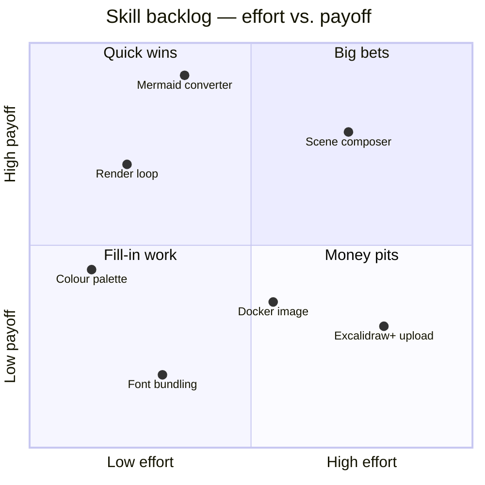

</td><td width="55%" valign="top">


</td></tr>
</table>

Source: [`example-quadrant.mmd`](example-quadrant.mmd) &rarr;
[`example-quadrant.excalidraw`](example-quadrant.excalidraw)

---

## `xychart-beta`

`title`, a categorical `x-axis`, a `y-axis` label and/or `min --> max`
range, and one or more `bar` / `line` series. Several `bar` series are
grouped side by side within each category; `line` series are drawn over them
with a dot per point. A legend appears as soon as there is more than one
series, and category labels that are too wide for their slot are tilted 45
degrees rather than overlapping.

Without an explicit `y-axis` range the range is taken from the data but
always extended to include zero, so bar lengths stay proportional. Adding
`horizontal` after `xychart-beta` swaps the axes.

<table>
<tr><td width="45%" valign="top">

```mermaid
xychart-beta
    title "Identity signal quality per field"
    x-axis "source field" ["shop.customer_id", "shop.d.phone", "shop.email", "shop.phone", "klav.custom_phone", "klav.email", "klav.external_id", "klav.phone_number"]
    y-axis "percent of records" 0 --> 100
    bar "fill %" [100, 75.3, 94.4, 61.5, 0, 98.6, 1.4, 62.2]
    bar "normalisation failure %" [0, 7.9, 0, 6.7, 100, 0, 100, 8.9]
```

</td><td width="55%" valign="top">


</td></tr>
</table>

Source: [`example-xychart.mmd`](example-xychart.mmd) &rarr;
[`example-xychart.excalidraw`](example-xychart.excalidraw)

---

## Rendering these yourself

`scripts/export_image.mjs` writes the SVG and then shells out to
`rsvg-convert` for the PNG:

```bash
npm ci --prefix scripts                       # one-time: jsdom + @excalidraw/utils
node scripts/export_image.mjs in.excalidraw out.png
```

Requires a modern Node (the ESM import fails on Node < 14). If
`rsvg-convert` isn't installed the SVG is still written and another
rasterizer can finish the job — but **not `inkscape`**:

> Inkscape silently renders digit-only `<text>` nodes as blank. On a
> flowchart you may not notice; on a `xychart-beta` or `gantt` it drops
> every numeric axis tick while leaving the gridlines in place, which looks
> like an emitter bug and isn't one. Check a numeric label before trusting
> an inkscape-rendered chart.

Headless Chrome is a faithful fallback:

```bash
google-chrome --headless --disable-gpu --hide-scrollbars \
  --window-size=1200,1064 --screenshot=out.png page.html   # page.html embeds out.svg
```

Either way the fonts must resolve, or labels fall back to a system face.
`export_image.mjs` points fontconfig at `fonts/` itself; outside it, do the
same:

```bash
export FONTCONFIG_FILE=/path/to/fonts.conf   # <dir>…/excalidraw-diagram/fonts</dir>
fc-match "Comic Shanns"                      # should not say DejaVu
```

Multi-diagram scenes are composed from these same `.mmd` files via
`scripts/compose.py` and a scene TOML — see
[`example-scene.toml`](example-scene.toml).
