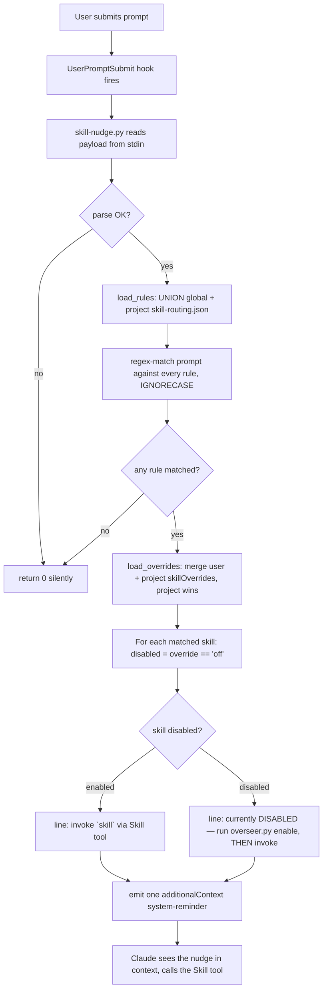
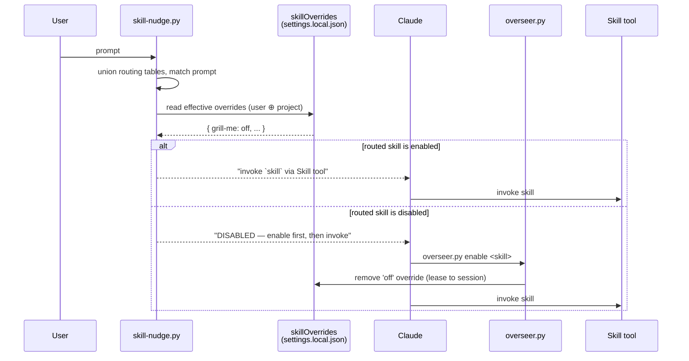
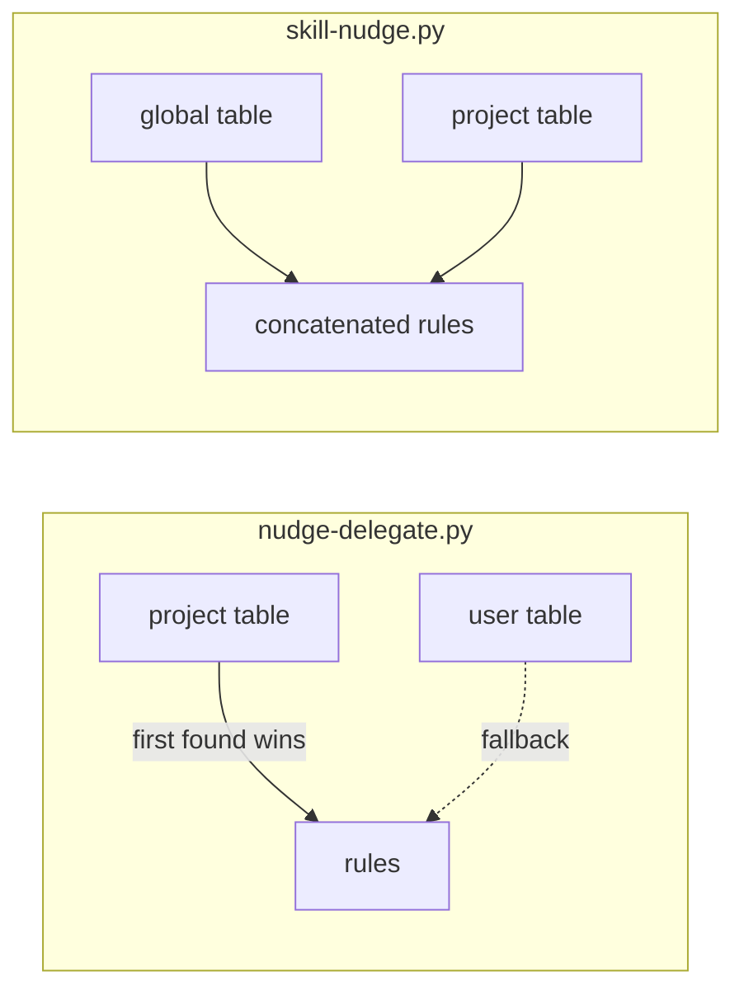
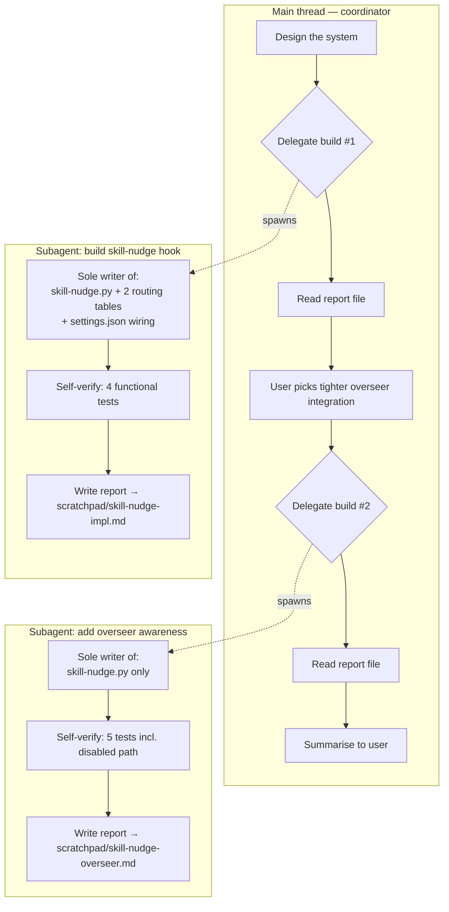

# Skill-nudge system

Data-driven **skill routing** for Claude Code: a `UserPromptSubmit` hook that reads
the shape of each prompt and nudges Claude to invoke the relevant skills — and, when a
routed skill has been parked off by **skill-overseer**, tells Claude to lease it back
on first.

It complements `skill-overseer` rather than overlapping it:

| Layer | Owns | Question it answers |
|---|---|---|
| **skill-overseer** | Availability lifecycle — leasing disabled pool skills, reaping dead sessions, flipping `skillOverrides` | "Is this skill *callable* right now?" |
| **skill-nudge** (this system) | Invocation steering — prompt shape → which skills to use | "Given this prompt, which *available* skills should I invoke?" |

The seam between them: if routing points at a skill the overseer has disabled, the nudge
instructs Claude to enable it (via `overseer.py enable`) *before* invoking it.

---

## Component inventory

| Path | Role |
|---|---|
| `~/.claude/hooks/skill-nudge.py` | The hook. Unions routing tables, matches the prompt, consults effective overrides, emits one `additionalContext` reminder. |
| `~/.claude/skill-routing.json` | **Global** routing table (generic skills, e.g. `grill-me`). |
| `<repo>/.claude/skill-routing.json` | **Project** routing table (repo-specific skills, e.g. `audiovis-debug-visual`, `audiovis-fractal`). |
| `~/.claude/settings.json` | Wires `skill-nudge.py` into `UserPromptSubmit`. |
| `~/.claude/skills/skill-overseer/scripts/overseer.py` | The overseer CLI the nudge points at for disabled skills. |
| `<dir>/.claude/settings.local.json` → `skillOverrides` | Where enable/disable state actually lives (user + project). |

> **Precedent:** this mirrors the existing `nudge-delegate.py` + `delegate-routing.json`
> pair (global default, project table). The key behavioural difference is **union vs.
> override** — see [Table resolution](#table-resolution-union-not-override).

---

## Runtime flow

What happens on every prompt you submit:



Multiple rules can match one prompt — the reminder lists **all** matched skills. When no
matched skill is disabled, the output is byte-for-byte identical to the pre-overseer
version (overseer text appears only on disabled lines).

---

## Two-layer relationship

How skill-nudge and skill-overseer compose at runtime:



The overseer owns the *left edge* (making a skill available); the nudge owns the *right
edge* (getting Claude to use it). They meet at `skillOverrides`.

---

## Table resolution: union, not override

`skill-nudge.py` differs from `nudge-delegate.py` in how it combines tables:



- **delegate-routing** picks the *first* table found → project **replaces** user.
- **skill-routing** concatenates → global generic skills fire **everywhere**, project
  skills fire **only in that repo**. `grill-me` is always live; `audiovis-*` only in
  the audiovis repo.

---

## Routing table schema

```jsonc
{ "rules": [
  { "skill": "audiovis-debug-visual",          // skill name to invoke
    "match": "\\.psv\\b|\\b\\d:\\d\\d\\b.*glow", // regex, searched with IGNORECASE
    "hint":  "timestamped visual-debug request" } // shown in the nudge
] }
```

- A rule lacking `skill` or `match`, or whose `match` fails to compile, is skipped.
- All rules are searched; every match contributes a line to the single reminder.

**Current global table** (`~/.claude/skill-routing.json`):

| skill | fires on |
|---|---|
| `grill-me` | "grill me", "stress-test my/the plan/design", "get grilled" |

**Current audiovis table** (`<repo>/.claude/skill-routing.json`):

| skill | fires on |
|---|---|
| `audiovis-debug-visual` | `.psv`, `./logs/`, or a `M:SS` timestamp near a visual word (colour/glow/fractal/snare/kick/zoom/intensity/section) |
| `audiovis-fractal` | shader / envelope / section / glow / bloom / julia / palette / uniform / fractal |

---

## Override resolution (overseer awareness)

`load_overrides()` builds the **effective** `skillOverrides` map:

```python
def load_overrides() -> dict:
    '''Effective skillOverrides map: user first, project wins per-key.'''
    paths = [Path.home() / '.claude' / 'settings.local.json']
    project_dir = os.environ.get('CLAUDE_PROJECT_DIR', '')
    if project_dir:
        paths.append(Path(project_dir) / '.claude' / 'settings.local.json')

    overrides = {}
    for path in paths:
        try:
            with path.open() as fh:
                overrides.update(json.load(fh).get('skillOverrides', {}))
        except (OSError, json.JSONDecodeError, ValueError, AttributeError):
            continue  # missing/broken settings -> no overrides, never crash
    return overrides
```

- Read order: **user first, then project** → `dict.update` means **project wins per
  key** (matching how the overseer scopes overrides to a project).
- A skill is DISABLED iff `overrides.get(skill) == 'off'`. Absent key or any read error
  → treated as ENABLED. The hook never crashes; a broken settings file just degrades to
  "no overrides".

The message-building loop branches per skill:

```python
    overrides = load_overrides()
    overseer = 'python3 "$HOME/.claude/skills/skill-overseer/scripts/overseer.py"'

    lines = []
    for skill, hint in hits:
        suffix = f': {hint}' if hint else ''
        if overrides.get(skill) == 'off':
            lines.append(
                f'- `{skill}` (currently DISABLED){suffix} — enable it first by '
                f'running `{overseer} enable {skill}` (or invoking the '
                f'`skill-overseer` skill), THEN invoke `{skill}` via the Skill tool.'
            )
        else:
            lines.append(f'- `{skill}`{suffix}')
```

---

## Hook output envelope

The hook speaks the standard `UserPromptSubmit` contract — inject context, never block:

```json
{
  "hookSpecificOutput": {
    "hookEventName": "UserPromptSubmit",
    "additionalContext": "Skill nudge (based on the shape of your prompt, not certainty). The following skill(s) look relevant:\n- `audiovis-debug-visual`: timestamped visual-debug request against the exported PSV modulation logs\n- `audiovis-fractal`: fractal renderer / shader / visual modulation work\nInvoke each matching skill via the Skill tool BEFORE acting on the prompt. These are suggestions — skip one only if it is clearly irrelevant."
  }
}
```

When no rule matches, the hook prints nothing and returns 0.

### Worked example — disabled skill

Prompt `"grill me"` in a project where `skillOverrides: {"grill-me": "off"}`:

```text
- `grill-me` (currently DISABLED): user wants to be interrogated/stress-tested on a
  plan or design — enable it first by running `python3 "$HOME/.claude/skills/
  skill-overseer/scripts/overseer.py" enable grill-me` (or invoking the `skill-overseer`
  skill), THEN invoke `grill-me` via the Skill tool.
```

---

## How this was built — the subagent delegation flow

The implementation followed the repo's coordinator/worker discipline: the main thread
**routed**, subagents **wrote**. Two sequential delegations, each the sole writer of its
files, each reporting through a scratchpad file (not its return message).



Conventions applied (from the global working agreement):

- **Report-through-file:** each subagent wrote its full findings to a uniquely-named
  scratchpad markdown file and returned only the path; the coordinator read the file
  rather than trusting the return text.
- **Sole-writer boundary:** each subagent was told it was the only writer of its files
  and must not fork a child editing the same file. Build #2 edited *only*
  `skill-nudge.py`, leaving the routing tables and settings from Build #1 untouched.
- **Self-verification before return:** subagents ran their own tests (py_compile, JSON
  parse, piped sample payloads) and captured outputs verbatim; the coordinator reviewed
  verdicts, not raw test noise.

---

## Extending the system

- **Add a generic skill** → append a rule to `~/.claude/skill-routing.json`. It fires in
  every repo. Keep triggers tight to avoid noise (e.g. `grill-me` only on explicit
  "grill me" phrasing, not every "what are some ways…" prompt).
- **Add a repo skill** → create / edit `<repo>/.claude/skill-routing.json`. Checked into
  the repo, so it's shared with collaborators (a feature: the repo declares its own
  skills). For personal-only rules, keep them out of version control.
- **Route to a normally-disabled pool skill** (e.g. `diagnose`, `prototype`,
  `deep-research`) → just add the rule. Because the nudge is overseer-aware, it will tell
  Claude to `overseer.py enable <skill>` first, so the skill self-enables on the right
  prompt instead of silently failing to be callable.
- **Docker nudge folded in (done)** → `docker-skill-nudge.py`'s hardcoded triggers now
  live in the global routing table as ordinary `docker-fastapi` / `docker-web-ui` rules;
  the bespoke hook has been retired.

---

## Testing the hook by hand

```bash
# both audiovis skills (project table + global)
echo '{"prompt":"at 1:34 the glow has too much colour, logs in ./logs/"}' \
  | CLAUDE_PROJECT_DIR=/home/freman/dev/audiovis python3 ~/.claude/hooks/skill-nudge.py

# global-only generic skill
echo '{"prompt":"grill me on this plan"}' | python3 ~/.claude/hooks/skill-nudge.py

# disabled-skill path (simulate with a temp project dir)
mkdir -p /tmp/ov-test/.claude
printf '{"skillOverrides":{"grill-me":"off"}}' > /tmp/ov-test/.claude/settings.local.json
echo '{"prompt":"grill me"}' \
  | CLAUDE_PROJECT_DIR=/tmp/ov-test python3 ~/.claude/hooks/skill-nudge.py   # → DISABLED + enable hint

# no match → silent
echo '{"prompt":"what is the weather"}' | python3 ~/.claude/hooks/skill-nudge.py
```
