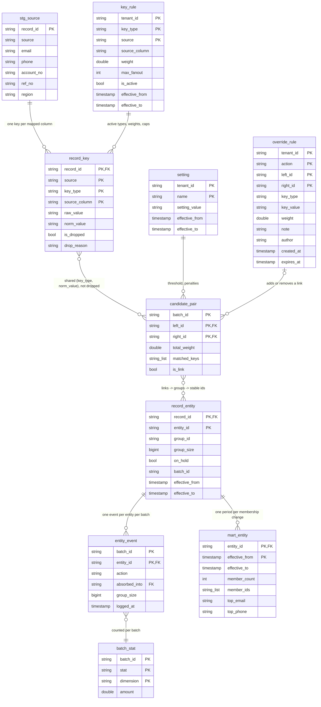

# Entity resolution: ERD with examples

This document describes a batch pipeline that decides which source records belong to the same real-world person.
Each batch run reads staged source records, extracts match keys, scores record pairs, groups linked records, and gives each group a stable entity id.

All names and values below are illustrative.

## Pipeline order

1. `stg_webstore` / `stg_newsletter` — staged source records.
2. `resolve.key_rule` + `resolve.record_key` — one row per usable match key on a record.
3. `resolve.setting` + `resolve.override_rule` + `resolve.candidate_pair` — pairs that share a key, their score, and whether they link.
4. `resolve.record_entity` — record-to-entity mapping, with history.
5. `resolve.entity_event` + `resolve.batch_stat` — audit log and per-batch counts.
6. `mart.entity` — one row per entity per membership period.

## Diagram

## Example scenario

- Tenant: `northwind`.
- Two sources: `webstore` and `newsletter`.
- Batch `b01` runs on 2025-11-03. Batch `b02` runs on 2025-11-10.
- Between the two batches, a support agent adds override rules.

Four records describe three people at first. After the overrides, they describe two.

## Staged sources: `stg_webstore` / `stg_newsletter`

The existing staged tables. Each source uses its own column names.

| record_id | source | email | phone | account_no | ref_no | region |
|---|---|---|---|---|---|---|
| webstore:5001 | webstore | Sam.Lee@Example.net | +61491570156 | 5001 | | AU |
| newsletter:N1 | newsletter | sam.lee@example.net | 0491 570 156 | | 5001 | AU |
| newsletter:N3 | newsletter | s.lee.home@example.org | +61491570156 | | | AU |
| webstore:5002 | webstore | noemail@shopfront.example | +61491570110 | 5002 | | AU |

## `resolve.key_rule`

Match key configuration per tenant, per key type, per source.

- `weight` is the score a shared value adds to a pair.
- `max_fanout` is the most records one value may appear on. A value above the cap is ignored for that batch.

| tenant_id | key_type | source | source_column | weight | max_fanout | is_active | effective_from | effective_to |
|---|---|---|---|---|---|---|---|---|
| northwind | email | webstore | email | 1.2 | 10 | true | 2025-10-01T00:00:00Z | |
| northwind | email | newsletter | primary_email | 1.0 | 10 | true | 2025-10-01T00:00:00Z | |
| northwind | account_no | webstore | account_no | 1.5 | 1 | true | 2025-10-01T00:00:00Z | |
| northwind | account_no | newsletter | ref_no | 1.5 | 1 | true | 2025-10-01T00:00:00Z | |
| northwind | phone | webstore | phone | 0.6 | 8 | true | 2025-10-01T00:00:00Z | |
| northwind | phone | newsletter | mobile_number | 0.6 | 8 | true | 2025-10-01T00:00:00Z | |

## `resolve.setting`

Tenant-level settings that apply to the whole run.

| tenant_id | name | setting_value | effective_from | effective_to |
|---|---|---|---|---|
| northwind | link_threshold | 1.4 | 2025-10-01T00:00:00Z | |
| northwind | max_group_size | 250 | 2025-10-01T00:00:00Z | |
| northwind | max_passes | 30 | 2025-10-01T00:00:00Z | |
| northwind | penalty.region_mismatch | -0.5 | 2025-10-01T00:00:00Z | |
| northwind | crossref.newsletter.ref_no.target | account_no | 2025-10-01T00:00:00Z | |
| northwind | crossref.newsletter.ref_no.pattern | `^[0-9]{1,12}$` | 2025-10-01T00:00:00Z | |

The two `crossref` rows say: a newsletter `ref_no` that matches the pattern is a webstore `account_no`.

## `resolve.record_key`

One row per match key value on a record, from all sources. Column names are mapped to a common `key_type`, and values are normalised (lower-case email, E.164 phone).

| record_id | source | key_type | source_column | raw_value | norm_value | is_dropped | drop_reason |
|---|---|---|---|---|---|---|---|
| webstore:5001 | webstore | account_no | account_no | 5001 | 5001 | false | |
| webstore:5001 | webstore | email | email | Sam.Lee@Example.net | sam.lee@example.net | false | |
| webstore:5001 | webstore | phone | phone | +61491570156 | +61491570156 | false | |
| newsletter:N1 | newsletter | email | primary_email | sam.lee@example.net | sam.lee@example.net | false | |
| newsletter:N1 | newsletter | phone | mobile_number | 0491 570 156 | +61491570156 | false | |
| newsletter:N1 | newsletter | account_no | ref_no | 5001 | 5001 | false | |
| newsletter:N3 | newsletter | email | primary_email | s.lee.home@example.org | s.lee.home@example.org | false | |
| newsletter:N3 | newsletter | phone | mobile_number | +61491570156 | +61491570156 | false | |
| webstore:5002 | webstore | account_no | account_no | 5002 | 5002 | false | |
| webstore:5002 | webstore | email | email | noemail@shopfront.example | noemail@shopfront.example | true | placeholder |
| webstore:5002 | webstore | phone | phone | +61491570110 | +61491570110 | false | |

## `resolve.override_rule`

Manual rules that add a link, or remove a link, between records.

- `action = link` adds an edge with the given `weight`.
- `action = unlink` removes a direct edge between two records, or drops a key value everywhere when `key_value` is set.

| tenant_id | action | left_id | right_id | key_type | key_value | weight | note | author | created_at | expires_at |
|---|---|---|---|---|---|---|---|---|---|---|
| northwind | link | newsletter:N3 | webstore:5001 | | | 1.5 | Customer confirmed both addresses by email | helpdesk-app | 2025-11-05T14:02:00Z | |
| northwind | unlink | newsletter:N1 | newsletter:N3 | | | | Shared household phone is not enough on its own | helpdesk-app | 2025-11-05T14:06:00Z | |
| northwind | unlink | | | email | noemail@shopfront.example | | Store checkout placeholder address | data-platform | 2025-11-01T08:30:00Z | |

## `resolve.candidate_pair`

One row per record pair that shares at least one non-dropped key value.

- `total_weight` is the sum, over shared key types, of the lower of the two source weights, plus any override weight.
- `is_link` is true when `total_weight >= link_threshold` (1.4) and no `unlink` rule applies.

| batch_id | left_id | right_id | total_weight | matched_keys | is_link |
|---|---|---|---|---|---|
| b01 | newsletter:N1 | webstore:5001 | 3.1 | account_no, email, phone | true |
| b01 | newsletter:N3 | webstore:5001 | 0.6 | phone | false |
| b01 | newsletter:N1 | newsletter:N3 | 0.6 | phone | false |
| b02 | newsletter:N1 | webstore:5001 | 3.1 | account_no, email, phone | true |
| b02 | newsletter:N3 | webstore:5001 | 2.1 | override, phone | true |
| b02 | newsletter:N1 | newsletter:N3 | 0.6 | phone | false |

In `b02`, `newsletter:N3` joins the group through `webstore:5001`. The `unlink` rule only stops the direct N1–N3 edge.

## `resolve.record_entity`

Answers "which entity is this record?" for all downstream consumers. It keeps history: a new row starts each time a record's entity or group size changes.

- New entity ids are `ent_<batch>_<seed record>`, where the seed is the lowest `record_id` in the group.
- An existing id is kept when a group grows, so ids stay stable across batches.

| record_id | entity_id | group_id | group_size | on_hold | batch_id | effective_from | effective_to |
|---|---|---|---|---|---|---|---|
| newsletter:N1 | ent_b01_newsletter:N1 | newsletter:N1 | 2 | false | b01 | 2025-11-03T01:30:00Z | 2025-11-10T01:30:00Z |
| webstore:5001 | ent_b01_newsletter:N1 | newsletter:N1 | 2 | false | b01 | 2025-11-03T01:30:00Z | 2025-11-10T01:30:00Z |
| newsletter:N3 | ent_b01_newsletter:N3 | newsletter:N3 | 1 | false | b01 | 2025-11-03T01:30:00Z | 2025-11-10T01:30:00Z |
| webstore:5002 | ent_b01_webstore:5002 | webstore:5002 | 1 | false | b01 | 2025-11-03T01:30:00Z | |
| newsletter:N1 | ent_b01_newsletter:N1 | newsletter:N1 | 3 | false | b02 | 2025-11-10T01:30:00Z | |
| webstore:5001 | ent_b01_newsletter:N1 | newsletter:N1 | 3 | false | b02 | 2025-11-10T01:30:00Z | |
| newsletter:N3 | ent_b01_newsletter:N1 | newsletter:N1 | 3 | false | b02 | 2025-11-10T01:30:00Z | |

`on_hold` is set when a group exceeds `max_group_size`. A held group keeps its previous ids until someone reviews it.

## `resolve.entity_event`

Append-only log of what happened to each entity in each batch, and why. Used to debug history.

| batch_id | entity_id | action | absorbed_into | group_size | logged_at |
|---|---|---|---|---|---|
| b01 | ent_b01_newsletter:N1 | created | | 2 | 2025-11-03T01:30:00Z |
| b01 | ent_b01_newsletter:N3 | created | | 1 | 2025-11-03T01:30:00Z |
| b01 | ent_b01_webstore:5002 | created | | 1 | 2025-11-03T01:30:00Z |
| b02 | ent_b01_newsletter:N1 | grew | | 3 | 2025-11-10T01:30:00Z |
| b02 | ent_b01_webstore:5002 | unchanged | | 1 | 2025-11-10T01:30:00Z |
| b02 | ent_b01_newsletter:N3 | absorbed | ent_b01_newsletter:N1 | | 2025-11-10T01:30:00Z |

## `resolve.batch_stat`

Counts per batch. `dimension` holds a sub-category, such as a drop reason; it is an empty string when not used.

| batch_id | stat | dimension | amount |
|---|---|---|---|
| b01 | records | | 4 |
| b01 | entities | | 3 |
| b01 | dropped_keys | placeholder | 1 |
| b01 | candidate_pairs | | 3 |
| b01 | links | | 1 |
| b01 | below_threshold_pairs | | 2 |
| b01 | entities_created | | 3 |
| b02 | links | | 2 |
| b02 | overrides_applied | | 2 |
| b02 | entities_grew | | 1 |
| b02 | entities_absorbed | | 1 |
| b02 | entities_unchanged | | 1 |

## `mart.entity`

One row per entity per membership period (type 2 slowly changing dimension: a changed row is closed with `effective_to` and a new row is opened).

| entity_id | effective_from | effective_to | member_count | member_ids | top_email | top_phone |
|---|---|---|---|---|---|---|
| ent_b01_newsletter:N1 | 2025-11-03T01:30:00Z | 2025-11-10T01:30:00Z | 2 | newsletter:N1, webstore:5001 | sam.lee@example.net | +61491570156 |
| ent_b01_newsletter:N1 | 2025-11-10T01:30:00Z | | 3 | newsletter:N1, newsletter:N3, webstore:5001 | sam.lee@example.net | +61491570156 |
| ent_b01_newsletter:N3 | 2025-11-03T01:30:00Z | 2025-11-10T01:30:00Z | 1 | newsletter:N3 | s.lee.home@example.org | +61491570156 |
| ent_b01_webstore:5002 | 2025-11-03T01:30:00Z | | 1 | webstore:5002 | | +61491570110 |
